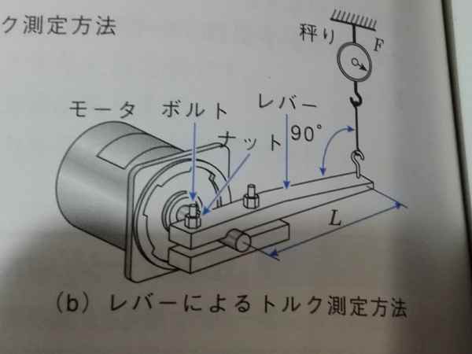
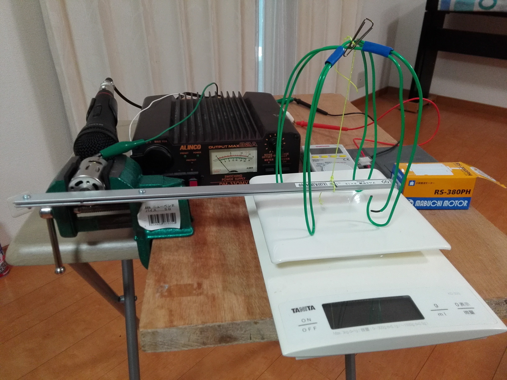
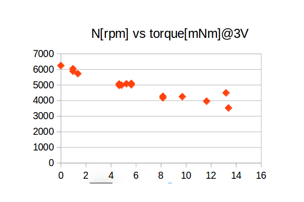

# モータの特性を測定する

## 説明

マブチモータのRS380PH-4045を測る。

電圧、電流、回転数、トルクを取りたい。

### トルク測定

測りたいトルクは、擦れることでアルミプレートに発生するトルクに等しい。アルミプレートの自重の影響を除けば、そのトルクは糸の張力と腕の長さの積に等しい。
糸の張力は、はかりで測った重さに重力加速度をかければわかる。

力学的には、モータ軸まわりの力のモーメントの釣り合いの式が成り立つ。軸との摩擦で発生する力によるモーメントの合計がトルク。

わざわざ糸で吊って、緑色の針金の四足で支えるのは、糸なら水平方向の力が働かないと考えたため。水平方向の力は誤差の原因になる。

### 回転数測定

モータの軸が短く、何も取り付けられないから光を使って測ることができなかった。
そこで、マイクで音を拾ってＰＣでフーリエ変換した。Ubuntu Linuxでpythonを使った。　pyaudioというモジュールのCHUNKというパラメータを512にしたらやっと動作した。それまではoverflowというstatusが来ていた。USBマイクのスペックなどが分からないのが不満。

### 電圧、電流
電圧は、デジタルマルチメータで測る。電流は電源にアナログメータが付いていて、だいたい分かる。

## 問題

### 発熱

火おこし器の原理と同じのため、出力はすべて摩擦でジュール熱になる。
アルミプレートの溝の狭い空間で発熱するので熱くなっていた。
熱伝導がよくて熱が逃げやすい材料（金属など）で作るのは絶対。
3V 3Aで効率が５０％ぐらいの時4.5Wが出力で、それがジュール熱になる。この位が限界かもしれない。

### 回転数が変動する

摩擦力が一定していないのが原因か。

### データシート

メーカーのデータシートが２つ出てきたが、N-Tカーブの傾きが違う。
ブラシとコミューテータの間の接触抵抗は、回転数、電流やコンディションで変わるらしい。
仮説だが原因は接触抵抗かもしれない。

スペックが変わった可能性はないのか？
データシートによって、電圧は、normal voltage,nominal voltage,operating voltageと用語が違うし、その値も違うのは気になる。

